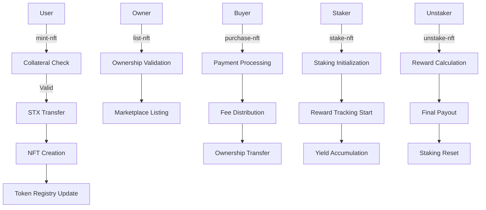

# StacksVault

## Institutional-Grade Asset-Backed NFTs on Stacks

[](https://stacks.co)
[](https://bitcoin.org)
[](https://clarity-lang.org)

## Overview

StacksVault is a sophisticated NFT infrastructure protocol that enables institutional-grade asset tokenization with comprehensive collateralization, yield generation, and decentralized trading mechanisms. Built specifically for the Stacks Layer 2 ecosystem, it provides enterprise-ready infrastructure for tokenizing real-world and digital assets through mathematically-secured NFTs with Bitcoin's security guarantees.

## Key Features

### 🏦 **Core Financial Infrastructure**

- Multi-tier collateralization with dynamic risk assessment (150% minimum ratio)
- Automated yield distribution through proof-of-stake mechanisms (5% APY)
- Fractional ownership with granular share management
- Institutional-grade compliance and audit trails

### 📈 **Market Operations**

- Decentralized price discovery through on-chain orderbooks
- Protocol-level fee optimization (2.5% trading fees)
- Cross-chain asset bridging readiness for Bitcoin L1 settlement
- Automated market making through liquidity provision incentives

### 🛡️ **Risk Management**

- Real-time collateral monitoring with liquidation protection
- Multi-signature governance for critical parameter updates
- Insurance fund integration for systemic risk mitigation
- Regulatory compliance framework with KYC/AML hooks

## System Architecture

```
┌─────────────────────────────────────────────────────────────┐
│                    StacksVault Protocol                     │
├─────────────────────────────────────────────────────────────┤
│                                                             │
│  ┌─────────────┐    ┌─────────────┐    ┌─────────────┐     │
│  │    NFT      │    │ Marketplace │    │   Staking   │     │
│  │   Engine    │◄──►│   Engine    │◄──►│   Engine    │     │
│  └─────────────┘    └─────────────┘    └─────────────┘     │
│         │                   │                   │          │
│         ▼                   ▼                   ▼          │
│  ┌─────────────┐    ┌─────────────┐    ┌─────────────┐     │
│  │Collateral   │    │ Fee & Price │    │   Yield     │     │
│  │Management   │    │ Discovery   │    │Distribution │     │
│  └─────────────┘    └─────────────┘    └─────────────┘     │
│                                                             │
├─────────────────────────────────────────────────────────────┤
│                    Data Layer                               │
├─────────────────────────────────────────────────────────────┤
│                                                             │
│  ┌─────────────┐    ┌─────────────┐    ┌─────────────┐     │
│  │   Token     │    │  Listing    │    │ Fractional  │     │
│  │  Registry   │    │  Registry   │    │ Ownership   │     │
│  └─────────────┘    └─────────────┘    └─────────────┘     │
│                                                             │
└─────────────────────────────────────────────────────────────┘
                              │
                              ▼
                    ┌─────────────────┐
                    │  Stacks Layer 2 │
                    └─────────────────┘
                              │
                              ▼
                    ┌─────────────────┐
                    │ Bitcoin Layer 1 │
                    │   Settlement    │
                    └─────────────────┘
```

## Contract Architecture

### Core Components

#### **1. Token Management System**

```clarity
define-map tokens
  { token-id: uint }
  {
    owner: principal,
    uri: (string-ascii 256),
    collateral: uint,
    is-staked: bool,
    stake-timestamp: uint,
    fractional-shares: uint,
  }
```

#### **2. Marketplace Infrastructure**

```clarity
define-map token-listings
  { token-id: uint }
  {
    price: uint,
    seller: principal,
    active: bool,
  }
```

#### **3. Fractional Ownership Registry**

```clarity
define-map fractional-ownership
  {
    token-id: uint,
    owner: principal,
  }
  { shares: uint }
```

#### **4. Staking & Rewards System**

```clarity
define-map staking-rewards
  { token-id: uint }
  {
    accumulated-yield: uint,
    last-claim: uint,
  }
```

## Data Flow



## Installation & Deployment

### Prerequisites

- [Clarinet](https://github.com/hirosystems/clarinet) CLI tool
- Stacks wallet for testnet/mainnet deployment
- Node.js 16+ for development tools

### Local Development

```bash
# Clone the repository
git clone https://github.com/your-org/stacksvault
cd stacksvault

# Install Clarinet
curl --proto '=https' --tlsv1.2 -sSf https://raw.githubusercontent.com/hirosystems/clarinet/main/install.sh | sh

# Initialize project
clarinet new stacksvault-project
cd stacksvault-project

# Add the contract
cp ../stacksvault.clar contracts/

# Run tests
clarinet test

# Local deployment
clarinet console
```

### Testnet Deployment

```bash
# Deploy to testnet
clarinet deploy --testnet

# Verify deployment
clarinet call-read-only contracts/stacksvault get-token-info u1 --testnet
```

## Usage Examples

### Minting Asset-Backed NFTs

```clarity
;; Mint an NFT with 1000 STX collateral
(contract-call? .stacksvault mint-nft 
  "https://metadata.example.com/asset/1" 
  u1000000) ;; 1000 STX in microSTX
```

### Marketplace Operations

```clarity
;; List NFT for sale
(contract-call? .stacksvault list-nft u1 u500000) ;; 500 STX

;; Purchase NFT
(contract-call? .stacksvault purchase-nft u1)
```

### Staking for Yield

```clarity
;; Stake NFT to earn rewards
(contract-call? .stacksvault stake-nft u1)

;; Check accumulated rewards
(contract-call? .stacksvault calculate-rewards u1)

;; Unstake and claim rewards
(contract-call? .stacksvault unstake-nft u1)
```

### Fractional Ownership

```clarity
;; Transfer fractional shares
(contract-call? .stacksvault transfer-shares 
  u1 
  'SP2RECIPIENT... 
  u250) ;; Transfer 250 shares
```

## Protocol Parameters

| Parameter | Value | Description |
|-----------|--------|-------------|
| Minimum Collateral Ratio | 150% | Required over-collateralization |
| Protocol Fee | 2.5% | Trading fee on marketplace transactions |
| Annual Yield Rate | 5% | Staking reward rate |
| Maximum URI Length | 256 chars | Metadata URI constraint |

## Security Considerations

### Collateral Management

- **Over-collateralization**: 150% minimum ratio protects against market volatility
- **Liquidation Protection**: Automated monitoring prevents under-collateralized positions
- **Audit Trails**: Complete transaction history for compliance

### Smart Contract Security

- **Input Validation**: Comprehensive validation on all user inputs
- **Overflow Protection**: Safe arithmetic operations throughout
- **Access Controls**: Proper ownership verification for all operations

### Economic Security

- **Fee Structure**: Balanced incentives for protocol sustainability
- **Yield Distribution**: Mathematical precision in reward calculations
- **Market Dynamics**: Anti-manipulation measures in pricing

## Governance & Upgrades

StacksVault implements a decentralized governance framework:

- **Parameter Updates**: Community voting on protocol parameters
- **Emergency Pause**: Multi-signature emergency controls
- **Upgrade Path**: Modular architecture supports seamless upgrades
- **Treasury Management**: Protocol fees fund development and security

## Compliance & Legal

### Regulatory Readiness

- **KYC/AML Integration**: Hooks for regulatory compliance
- **Audit Trail**: Complete transaction history
- **Reporting Tools**: Built-in compliance reporting capabilities
- **Legal Framework**: Designed for institutional adoption

### Risk Disclosures

- Smart contract risk from code vulnerabilities
- Market risk from asset price volatility
- Regulatory risk from evolving legal frameworks
- Liquidity risk in secondary markets

## Contributing

We welcome contributions from the community. Please see our [Contributing Guidelines](CONTRIBUTING.md) for details on:

- Code standards and review process
- Testing requirements
- Documentation standards
- Security disclosure process
